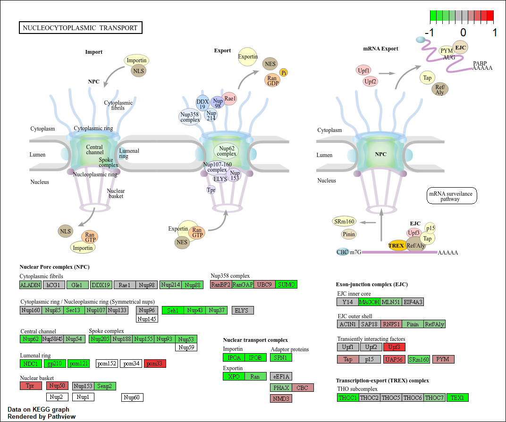
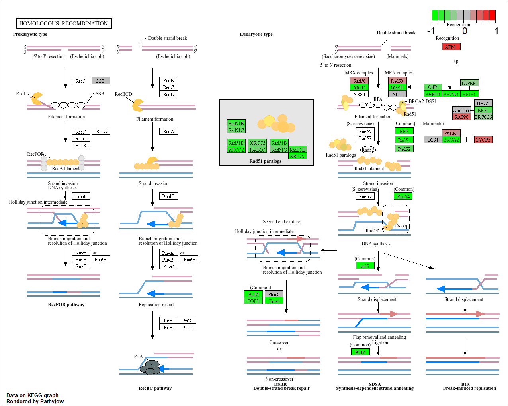

```{r}
library(DESeq2)

metaFile <- "GSE37704_metadata.csv"
countFile <- "GSE37704_featurecounts.csv"

# Import metadata and take a peek
colData = read.csv(metaFile, row.names=1)
head(colData)

# Import countdata
countData = read.csv(countFile, row.names=1)
head(countData)


```

> **Q. Complete the code below to remove the troublesome first column from countData**

```{r}
# Note we need to remove the odd first $length col
countData <- as.matrix(countData[,-1])
head(countData)
```

> **Q. Complete the code below to filter countData to exclude genes (i.e. rows) where we have 0 read count across all samples (i.e. columns).**

```{r}
# Filter count data where you have 0 read count across all samples.
countData = countData[rowSums(countData) > 0, ]
head(countData)
```

```{r}
##Setup the DESeqDataSet object
dds = DESeqDataSetFromMatrix(countData=countData,
                             colData=colData,
                             design=~condition)


#Run the DESeq pipeline
dds = DESeq(dds)
dds

##Get results for HoxA1 knockdown versus control siRNA
res = results(dds, contrast=c("condition", "hoxa1_kd", "control_sirna"))
head(res)


res = results(dds)
```

> **Q. Call the summary() function on your results to get a sense of how many genes are up or down-regulated at the default 0.1 p-value cutoff.**

```{r}
summary(res)
```

```{r}
library(ggplot2)

# Convert results to a data frame for ggplot
res_df <- as.data.frame(res)

ggplot(res_df) +
  aes(x = log2FoldChange, 
      y = -log10(padj)) +
  geom_point()
```

> > **Q. Improve this plot by completing the below code, which adds color, axis labels and cutoff lines:**

```{r}
res_df <- as.data.frame(res)

# Make a color vector for all genes
mycols <- rep("gray", nrow(res_df))

# Color blue the genes with fold change above 2
mycols[ abs(res_df$log2FoldChange) > 2 ] <- "blue"

# Color gray those with adjusted p-value more than 0.01
mycols[ res_df$padj > 0.01 ] <- "gray"

ggplot(res_df) +
  aes(x = log2FoldChange,
      y = -log10(padj)) +
  geom_point(col = mycols) +
  xlab("Log2(FoldChange)") +
  ylab("-Log(P-value)") +
  geom_vline(xintercept = c(-2,2)) +
  geom_hline(yintercept = -log10(0.01))
```

> **Q. Use the mapIDs() function multiple times to add SYMBOL, ENTREZID and GENENAME annotation to our results by completing the code below.**

```{r}
library("AnnotationDbi")
library("org.Hs.eg.db")

columns(org.Hs.eg.db)

## Map to Gene Symbols
res$symbol = mapIds(org.Hs.eg.db,
                    keys=row.names(res), 
                    keytype="ENSEMBL",
                    column="SYMBOL",
                    multiVals="first")

## Map to Entrez IDs
res$entrez = mapIds(org.Hs.eg.db,
                    keys=row.names(res),
                    keytype="ENSEMBL",
                    column="ENTREZID",
                    multiVals="first")

## Map to Full Gene Names
res$name =   mapIds(org.Hs.eg.db,
                    keys=row.names(res),
                    keytype="ENSEMBL",
                    column="GENENAME",
                    multiVals="first")

head(res, 10)
```

> \*\*Q. Finally for this section let's reorder these results by adjusted p-value and save them to a CSV file in your current project directory.

```{r}
## Reorder results by adjusted p-value (padj)
res = res[order(res$padj), ]

## Save to a CSV file
write.csv(res, file="deseq_results.csv")
```

```{r}
library(pathview)
library(gage)
library(gageData)

data(kegg.sets.hs)
data(sigmet.idx.hs)

# Focus on signaling and metabolic pathways only
kegg.sets.hs = kegg.sets.hs[sigmet.idx.hs]

# Examine the first 3 pathways
head(kegg.sets.hs, 3)


```

```{r}
foldchanges = res$log2FoldChange
names(foldchanges) = res$entrez
head(foldchanges)
```

```{r}
# Get the results
keggres = gage(foldchanges, gsets=kegg.sets.hs)
```

```{r}
attributes(keggres)
head(keggres$less)
```

```{r}
pathview(gene.data=foldchanges, pathway.id="hsa04110")
```


```{r}
## Focus on top 5 upregulated pathways here for demo purposes only
keggrespathways <- rownames(keggres$greater)[1:5]

# Extract the 8 character long IDs part of each string
keggresids = substr(keggrespathways, start=1, stop=8)
keggresids
```

```{r}
pathview(gene.data=foldchanges, pathway.id=keggresids, species="hsa")
```

> **Q. Can you do the same procedure as above to plot the pathview figures for the top 5 down-regulated pathways?**

```{r}
## Extract the names of the top 5 down-regulated pathways
keggrespathways_down <- rownames(keggres$less)[1:5]

##Extract the 8-character long KEGG IDs (e.g., "hsa04110")
keggresids_down = substr(keggrespathways_down, start=1, stop=8)

## Print the IDs to verify them
keggresids_down

## Pass the down-regulated IDs to pathview
pathview(gene.data=foldchanges, pathway.id=keggresids_down, species="hsa")
```








```{r}
data(go.sets.hs)
data(go.subs.hs)

# Focus on Biological Process subset of GO
gobpsets = go.sets.hs[go.subs.hs$BP]

gobpres = gage(foldchanges, gsets=gobpsets)

lapply(gobpres, head)
```

```{r}
sig_genes <- res[res$padj <= 0.05 & !is.na(res$padj), "symbol"]
print(paste("Total number of significant genes:", length(sig_genes)))
```

```{r}
write.table(sig_genes, file="significant_genes.txt", row.names=FALSE, col.names=FALSE, quote=FALSE)
```

>**Q: What pathway has the most significant “Entities p-value”? Do the most significant pathways listed match your previous KEGG results? What factors could cause differences between the two methods?**

Cell Cycle with a p-value of 26e-5.Yes, they match significantly. Yes, these results match my KEGG analysis, as Cell Cycle was also the top-ranked pathway in your previous GAGE results. Differences arise because Reactome uses hierarchical overrepresentation testing (counting "hits"), whereas KEGG/GAGE uses enrichment testing based on the magnitude of fold changes across all genes.


